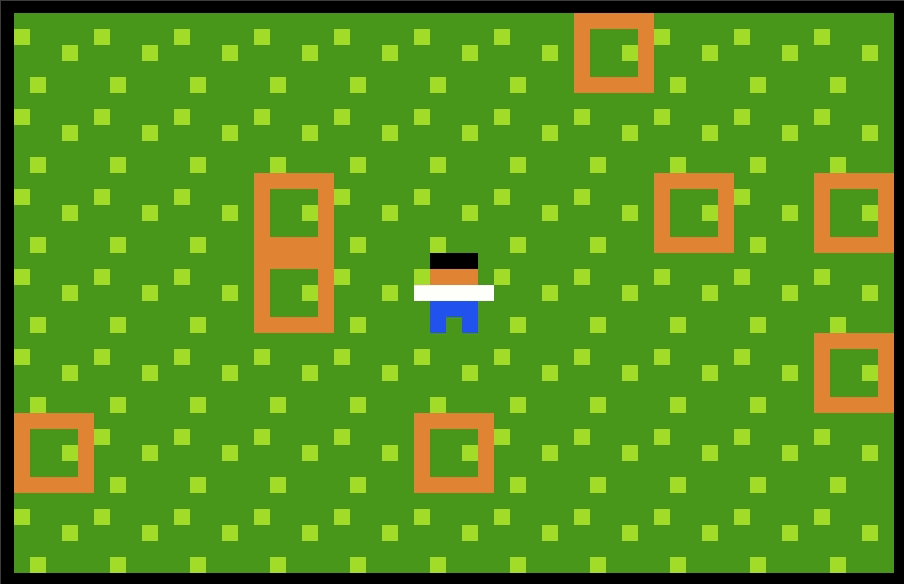

# `smoothscreen` for PuzzleScript

This patch for PuzzleScript adds a new prelude option, `smoothscreen`, which zooms the camera in on a region around the player and smoothly scrolls the camera as the player moves around.

```
smoothscreen 11x7 3x3
```

 

The second image is Draknek's [You're Pulleying My Leg](https://www.draknek.org/games/puzzlescript/pulleys.php) with `smoothscreen` added.

## Applying the patch

To use `smoothscreen`, you need to apply the patch to the PuzzleScript source code. To do so, first clone the PuzzleScript source and move into the directory:

```bash
git clone https://github.com/increpare/PuzzleScript.git
cd PuzzleScript
```

Then download the patch, [`smoothscreen.patch`](https://raw.githubusercontent.com/sftrabbit/PuzzleScript-smoothscreen/main/smoothscreen.patch), and apply it to the PuzzleScript source:

```base
wget https://raw.githubusercontent.com/sftrabbit/PuzzleScript-smoothscreen/main/smoothscreen.patch
git am < smoothscreen.patch
```

If you then run `./runserver` and go to `http://localhost:1234/PuzzleScript/` in your browser, you'll be using PuzzleScript with `smoothscreen` enabled.

**Note**: This patch was written against PuzzleScript commit `8932f2f`. It will likely apply smoothly to other commits, but not if there are any conflicting changes. If there are conflicts, you may need to resolve them manually.

**Note**: Why not just make a PuzzleScript fork with this feature? There are already lots of forks and I don't want to make another one. However, I'd be very happy for this feature to be added to any existing forks! Get in touch if you're having trouble applying it.

## Using `smoothscreen`

The simplest way to use `smoothscreen` is just like `zoomscreen` or `flickscreen` - simply provide the size of the region that you show around the player:

```
smoothscreen 11x7
```

This will zoom in on an 11x7 space around the player and the camera will scroll smoothly as the player moves about. However, sometimes you want to give the player some freedom to move about in the middle of the screen without always moving the camera. For this, you can optionally specify a boundary as the second argument:

```
smoothscreen 11x7 3x3
```

This gives the player a 3x3 area in the middle of the screen in which they can move without the camera following. When not specified, the default boundary is effectively 1x1.

When the camera follows the player, it will move a fraction of the distance to the player each frame (PuzzleScript runs at approximately 60fps). By default, this fraction is 0.125, so an eighth of the way towards the player. You can control the camera movement speed by adjusting this fraction with an optional third argument:

```
smoothscreen 11x7 3x3 0.01
```

This will be a veeeery slow camera!

**Tip**: You can effectively recreate `zoomscreen` by setting the camera speed argument to `1`. In fact, you can combine this with the boundary argument to get `zoomscreen` with a boundary - how neat!
