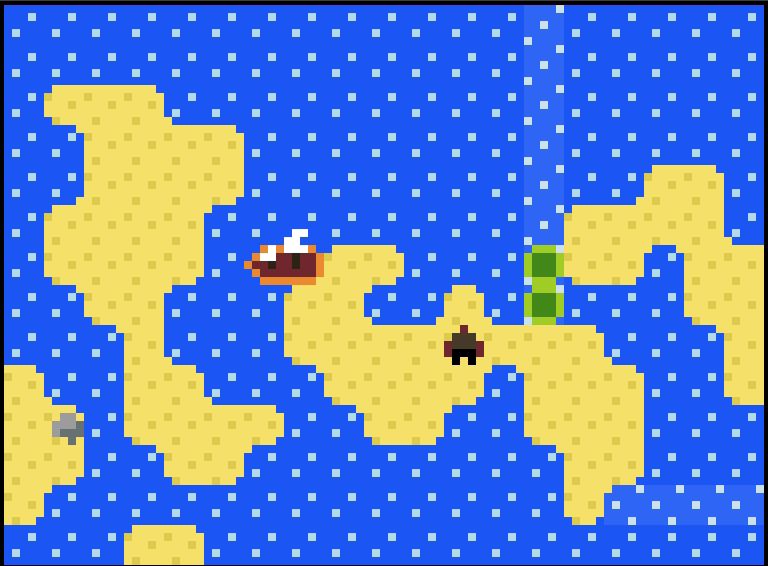
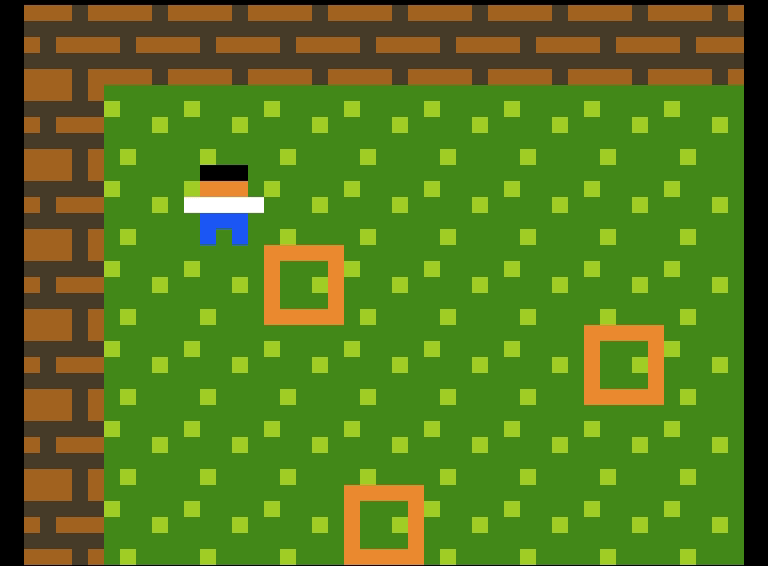
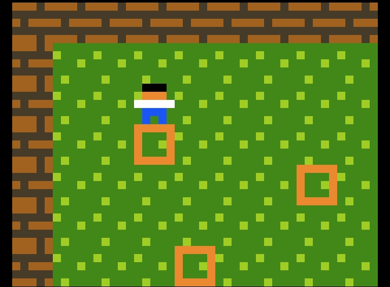
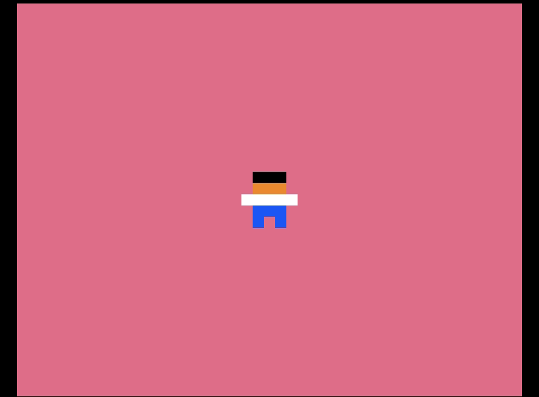
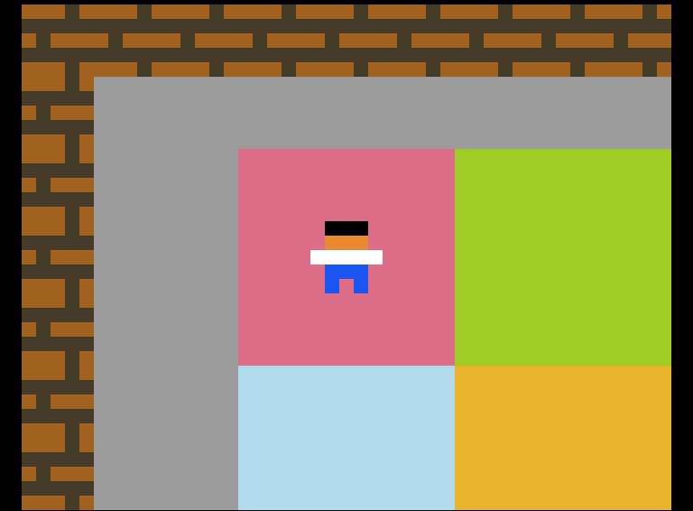

# `smoothscreen` for PuzzleScript

This PuzzleScript fork adds a new prelude option, `smoothscreen`, which zooms the camera in on a region around the player and smoothly scrolls the camera as the player moves around.

<a href="https://sftrabbit.github.io/PuzzleScript-smoothscreen/">Use the fork.</a>

  

<sup>Second and third images are Draknek's [You're Pulleying My Leg](https://www.draknek.org/games/puzzlescript/pulleys.php) and [Skipping Stones to Lonely Homes](https://www.draknek.org/games/puzzlescript/skipping-stones.php) with `smoothscreen` added.</sup>

## Using `smoothscreen`

The simplest way to use `smoothscreen` is just like `zoomscreen` or `flickscreen` - simply provide the size of the region that you want to zoom in on:

```
smoothscreen 9x7
```



However, sometimes you want to give the player some freedom to move about in the middle of the screen without moving the camera. For this, you can optionally specify a boundary as the second argument:

```
smoothscreen 9x7 3x3
```


When the camera follows the player, it will move a fraction of the distance to the player each frame (PuzzleScript runs at approximately 60fps). By default, this fraction is 0.125. You can control the camera movement speed by adjusting this fraction with an optional third argument:

```
smoothscreen 9x7 3x3 0.03
```



> **Tip**: You can effectively recreate non-smooth `zoomscreen` by setting the camera speed argument to `1`. In fact, you can combine this with the boundary argument to get `zoomscreen` with a boundary - how neat!

Use the `flick` keyword to make the camera move like `flickscreen`. The camera will always move by the full width or height of the given boundary. When a boundary is not given, it defaults to the camera size, recreating the `flickscreen` effect:

```
smoothscreen flick 9x7
```



The `flick` keyword can be combined with a boundary size to flick around between areas smaller than the camera size:

```
smoothscreen flick 9x7 3x3
```



One subtle difference between this `flick` keyword and `flickscreen` is that this one won't let the camera show anything out of bounds of the level. So if the camera doesn't quite cover the entire level, you might need to pad out the level to fit the next camera position.
